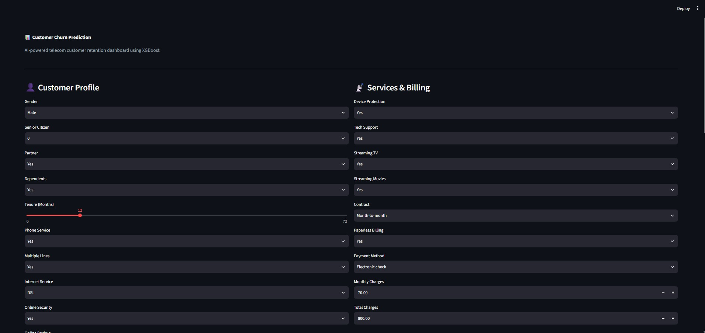
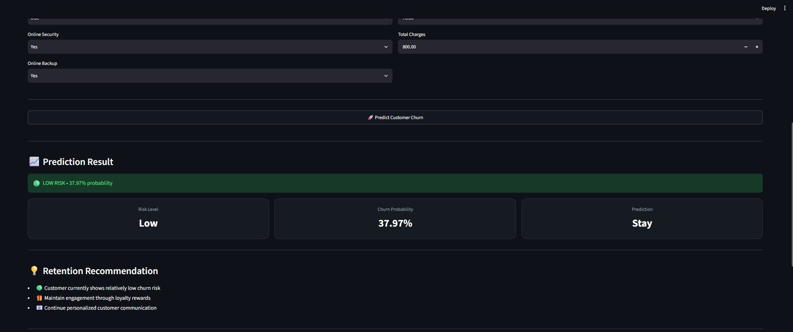
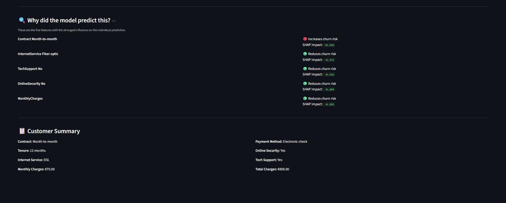

# 📊 Customer Churn Prediction

> End-to-end Explainable AI application for predicting telecom customer churn using XGBoost, SHAP, FastAPI, and Streamlit.



## Live Demo
Coming Soon

## Tech Stack

- Python
- Pandas & NumPy
- Scikit-learn
- XGBoost
- SHAP
- FastAPI
- Streamlit

## Project Architecture

Customer Data
      ↓
Streamlit Dashboard
      ↓
FastAPI REST API
      ↓
XGBoost Model
      ↓
SHAP Explainability
      ↓
Churn Prediction

## Model Performance

| Metric | Score |
|--------|------:|
| ROC-AUC | **0.8458** |
| Recall | **78.88%** |
| Precision | **52.49%** |
| F1 Score | **0.6303** |

## Dashboard



## Explainable AI

The application uses SHAP values to explain every prediction and identify the most influential customer features.

## Project Structure

```text
api/            FastAPI backend
app/            Streamlit frontend
models/         Trained XGBoost model
notebooks/      EDA & model training
images/         README screenshots
```

## Installation

```bash
git clone https://github.com/PRAJWAL2866/customer-churn-prediction.git
cd customer-churn-prediction
pip install -r requirements.txt
```

### Run FastAPI

```bash
cd api
uvicorn main:app --reload
```

### Run Streamlit

```bash
cd app
streamlit run app.py
```

## Author

**Prajwal Phalke**

MSc Data Science | Machine Learning | Explainable AI
